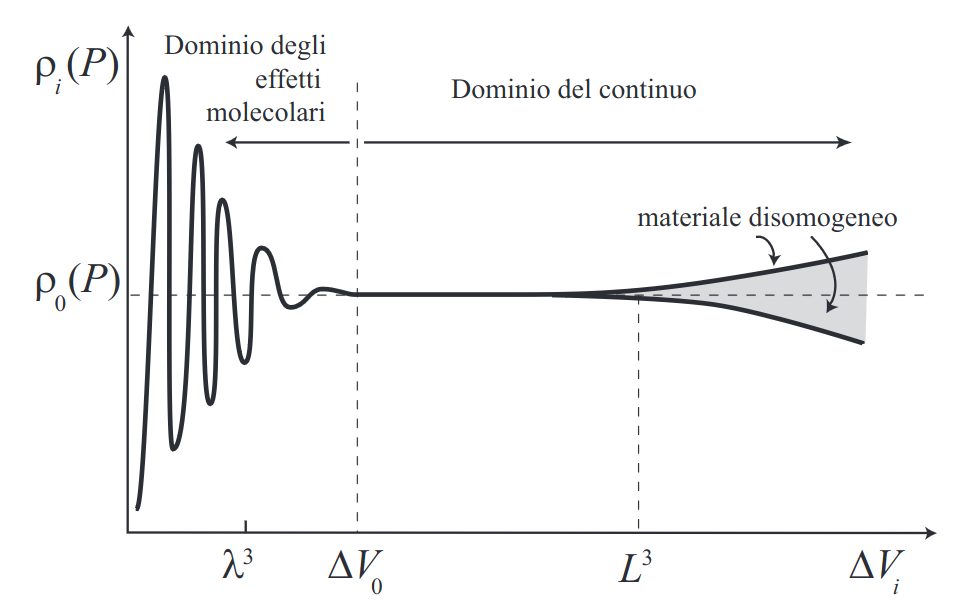

# CAPITOLO 1

## Lezione 1

### Dominio molecolare ed eterogeneità

$\Delta V_0$ viene chiamato minimo volume elementare

$\displaystyle L=|\frac{\rho}{\frac{d\rho}{dx}}|$

$\displaystyle \rho (p)=\lim_{\Delta V_i \to \Delta V_0} \frac{\Delta m_i}{\Delta V_i}=\frac{1}{\Delta V_0} \int_{\Delta V_0} dm$

$\displaystyle \rho (p)=\lim_{p' \to p}\rho (p')$

### Differenze ed analogie tra solidi e fluidi

Nelle forze di taglio: ssolidi e fluidi si comportano in modo diverso
Nelle forse normali applicate in tutto l corpo (pressione): solidi e fluidi si comportano allo stesso modo

### Legge di Stevino

$p(z)dxdy=p(z+dz)dx dy+\rho g dxdydz$

$(p(z+dz)-p(z))dxdy=-\rho g dxdydz$

$\frac{\partial p}{\partial z}=-\rho g$  legge di Stevino

CASO GENERALE:

$\overrightarrow{\nabla}p=-p\overrightarrow{g}$ con $\overrightarrow{g}=(0,0,-g) \to$ asse x rivolta verso l'alto

- $x = x_1 $
- $y = x_2 $
- $z = x_3 $

$\frac{\partial p}{\partial x_i}=-\rho g_i$   

oppure

$p,i=-\rho g_i$
### Spinta di archimede

### Vasi communicanti